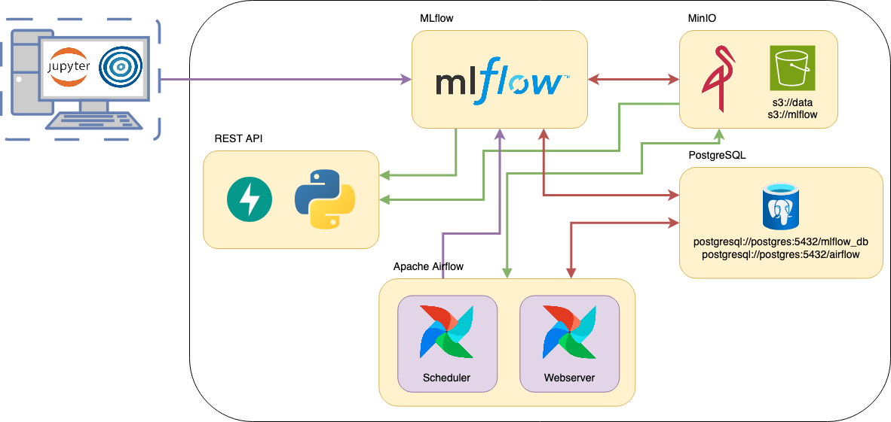

# Ejemplo de Implementación de un Modelo de predicción de robos en la Ciudad de Bs As en base a las condiciones climáticas

### AMq2 - CEIA - FIUBA

En este ejemplo, mostramos una implementación de un modelo productivo para detectar si un
paciente tiene una enfermedad cardiaca o no, utilizando el servicio de
**ML Models and something more Inc.**.

La implementación incluye:

- En Apache Airflow, un DAG que obtiene los datos del repositorio, realiza limpieza y
  feature engineering, y guarda en el bucket `s3://data` los datos separados para entrenamiento
  y pruebas. MLflow hace seguimiento de este procesamiento.
- Una notebook para ejecutar localmente con Optuna, que realiza una búsqueda de
  hiperparámetros y encuentra el mejor modelo utilizando F1-score. Todo el experimento se
  registra en MLflow, se generan gráficos de importancia de características, y además, se
  registra el modelo en el registro de modelos de MLflow.
- Un servicio de API del modelo, que toma el artefacto de MLflow y lo expone para realizar
  predicciones.
- En Apache Airflow, un DAG que, dado un nuevo conjunto de datos, reentrena el modelo. Se
  compara este modelo con el mejor modelo (llamado `champion`), y si es mejor, se reemplaza. Todo
  se lleva a cabo siendo registrado en MLflow.



## Testeo de Funcionamiento

El orden para probar el funcionamiento completo es el siguiente:

1. Primero debemos levantar los servicios ejecutando:

```
docker compose --profile all up
```

2. Tan pronto como se levante el sistema multi-contenedor, ejecuta en Airflow el DAG
   llamado `etl_process`, de esta manera se crearán los datos en el
   bucket `s3://data`.
3. Ejecuta la notebook (ubicada en `hyperparam_search`) para realizar la búsqueda de
   hiperparámetros y entrenar el mejor modelo.
4. Utiliza el servicio de API.

Además, una vez entrenado el modelo, puedes ejecutar el DAG `retrain_the_model` para probar
un nuevo modelo que compita con el campeón.

### API

Podemos realizar predicciones utilizando la API, accediendo a `http://localhost:8800/`.

Se puede encontrar un ejemplo en `notebook/api_test.ipynb`.

Para obtener más detalles sobre la API, ingresa a `http://localhost:8800/docs`.

Nota: Recuerda que si esto se ejecuta en un servidor diferente a tu computadora, debes reemplazar
`localhost` por la IP correspondiente o el dominio DNS, si corresponde.

Nota: Recordar que si esto se ejecuta en un servidor aparte de tu computadora, reemplazar a
localhost por la IP correspondiente o DNS domain si corresponde.

La forma en que se implementó tiene la desventaja de que solo se puede hacer una predicción a
la vez, pero tiene la ventaja de que FastAPI y Pydantic nos permiten tener un fuerte control
sobre los datos sin necesidad de agregar una línea de código adicional. FastAPI maneja toda
la validación.

Otra forma más típica es pasar los features como una lista u otro formato similar con
N observaciones y M features, lo que permite realizar varias predicciones al mismo tiempo.
Sin embargo, se pierde la validación automática.
