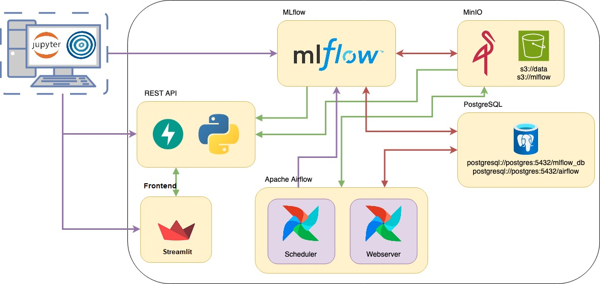

# Ejemplo de Implementación de un Modelo de predicción de robos en la Ciudad de Bs As en base a las condiciones climáticas

### AMq2 - CEIA - FIUBA

En este ejemplo, presentamos la implementación de un modelo predictivo que estima la cantidad de robos basándose en las condiciones climáticas, utilizando el servicio de
**ML Models and something more Inc.**.

La implementación incluye:

- En Apache Airflow, un DAG que obtiene los datos del repositorio, realiza limpieza y
  feature engineering, y guarda en el bucket `s3://data` los datos separados para entrenamiento
  y pruebas. MLflow hace seguimiento de este procesamiento.
- Una notebook para ejecutar localmente con Optuna, que realiza una búsqueda de
  hiperparámetros y encuentra el mejor modelo utilizando F1-score. Todo el experimento se
  registra en MLflow, se generan gráficos de importancia de características, y además, se
  registra el modelo en el registro de modelos de MLflow.
- Un servicio de API del modelo, que toma el artefacto de MLflow y lo expone para realizar
  predicciones.
- Un servicio de frontend, que al ingresar las observaciones del clima realiza peticiones a la API para obtener predicciones de   la cantidad de robos.
- En Apache Airflow, un DAG que, dado un nuevo conjunto de datos, reentrena el modelo. Se
  compara este modelo con el mejor modelo (llamado `champion`), y si es mejor, se reemplaza. Todo
  se lleva a cabo siendo registrado en MLflow.



## Testeo de Funcionamiento

El orden para probar el funcionamiento completo es el siguiente:

1. Primero debemos levantar los servicios ejecutando:

```
docker compose --profile all up
```

2. Tan pronto como se levante el sistema multi-contenedor, ejecuta en Airflow el DAG
   llamado `etl_process`, de esta manera se crearán los datos en el
   bucket `s3://data`.
3. Ejecuta la notebook (ubicada en `hyperparam_search`) para realizar la búsqueda de
   hiperparámetros y entrenar el mejor modelo.
4. Utiliza el servicio de API.
5. Utiliza el fronend para realizar predicciones.

Además, una vez entrenado el modelo, puedes ejecutar el DAG `retrain_the_model` para probar
un nuevo modelo que compita con el campeón.

### API

Podemos realizar predicciones utilizando la API, accediendo a `http://localhost:8800/`.

Se puede encontrar un ejemplo en `notebook/api_test.ipynb`.

Para obtener más detalles sobre la API, ingresa a `http://localhost:8800/docs`.

### Frontend

Podemos realizar predicciones utilizando un frontend en Streamlit, accediendo a `http://localhost:8501/`.


Nota: Recuerda que si esto se ejecuta en un servidor diferente a tu computadora, debes reemplazar
`localhost` por la IP correspondiente o el dominio DNS, si corresponde.
